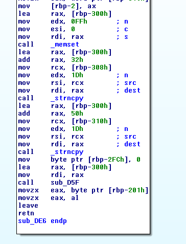
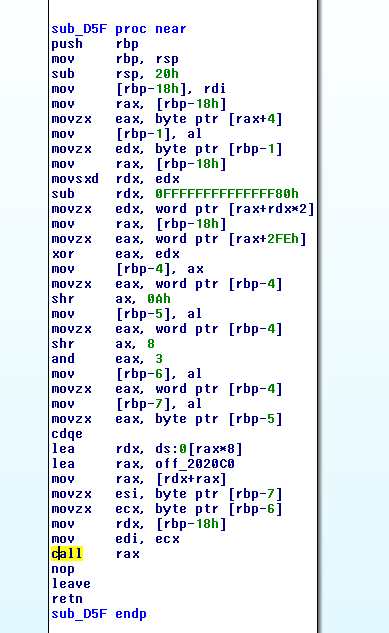

# BadVM

The second crackme for the sogeti escape challenge. The name let us imagine that it will be a VM to crack.

## Step 1 - Basic Reco

```bash
mitsurugi@dojo:~/chall/ESCAPE$ file BadVM
BadVM: ELF 64-bit LSB shared object, x86-64, version 1 (SYSV), dynamically linked, interpreter /lib64/ld-linux-x86-64.so.2, for GNU/Linux 2.6.32, BuildID[sha1]=518bad5ffe9b4112052b0b77359f357302bc4f1d, stripped
mitsurugi@dojo:~/chall/ESCAPE$ ls -l BadVM
-rwxr-xr-x 1 mitsurugi mitsurugi 10624 févr. 18 09:36 BadVM
mitsurugi@dojo:~/chall/ESCAPE$ strings -10 BadVM
/lib64/ld-linux-x86-64.so.2
__cxa_finalize
__libc_start_main
_ITM_deregisterTMCloneTable
__gmon_start__
_Jv_RegisterClasses
_ITM_registerTMCloneTable
GLIBC_2.2.5
[]A\A]A^A_
### BadVM 0.1 ###
Veuillez entrer le mot de passe:
Ca mouline ...
Plus qu'un instant 
 On avait la r
ponse depuis le d
but en faite :> 
wMdmS@#aXEW(Kh7Z
GCC: (Debian 6.3.0-18+deb9u1) 6.3.0 20170516
.note.ABI-tag
.note.gnu.build-id
.gnu.version
.gnu.version_r
.eh_frame_hdr
.init_array
.fini_array
mitsurugi@dojo:~/chall/ESCAPE$ ./BadVM 
### BadVM 0.1 ###

Veuillez entrer le mot de passe:
mitsurugi
Ca mouline ...
Plus qu'un instant ... On avait la réponse depuis le début en faite :> 
Perdu ...
mitsurugi@dojo:~/chall/ESCAPE$
```
The crackme asks for a password, then is really slow (count 4 or 5 full seconds to print the answer). This will slow down bruteforce :)
Another point to spot is the "On avait la réponse depuis le début en faite" (we had the answer since the beginning), despite the mistake seems to mean than the computation is done quickly and those message are only here to slow down things.

## Step 2 - the lazy way.
I tried automatic cracking, based on angr or pin ( http://0x90909090.blogspot.com/2018/01/solving-ctf-chall-easylazy-way-fic2018.html and http://0x90909090.blogspot.com/2018/01/solving-ctf-chall-crazyomg-way-fic2018.html ). Both fails. Too bad. We have to understand the inner guts of the VM to solve it :-)

## Step 3 - find the fetch-decode-execute
A VM is nothing more than a virtual CPU. If you want to break it, you have to find its opcodes, register and memory. The best way to find them is to find the routines which fetch, decode and execute instruction. With that you can deduce registers, instruction pointer and so on.

IDA can help here, we see this function which is really interesting:



we have a memset, then two strcpy. memset should prepare some space for the VM, then the strcpy() will put the opcodes. This function finish with call sub\_D5F, which looks like:



And its exactly what we search. This function decodes some bytes, then put an address in rax and executes here.

Now, let go dynamic (gdb powah!) and follow everything.
### opcodes
Opcode are read from address two bytes by two bytes:
```bash
gdb$ x/8gx 0x00007FFFFFFFDDD0
0x7fffffffddd0: 0x080b0401090108ff      0x0001090b04010914
0x7fffffffdde0: 0x0201090a182d200a      0x090d00000c020832
0x7fffffffddf0: 0x0a2d0d020aac0101      0x100106010a0d1502
0x7fffffffde00: 0x0d0209500201090a      0x08ff182320010101
```
So the VM is executing 0x8ff, then 0x0901, and 0x0401...
Those opcodes are decoded like this (I took 0x08ff for reference):
```
0x08ff >> 0xa = 2    => $rbp-5
0x08ff >> 8 & 3 = 0  => $rbp-6
0x08ff & 0xff = 0xff    => $rbp-7
```
The first one is the function call, the second and third one are context dependant.
All functions are here:
```
0x5555557560c0: 0x0000555555554a30      0x0000555555554a90
0x5555557560d0: 0x0000555555554af0      0x0000555555554b38
0x5555557560e0: 0x0000555555554b9b      0x0000555555554cdd
0x5555557560f0: 0x0000555555554bff      0x0000555555554c4f
0x555555756100: 0x0000555555554c7f      0x0000555555554d4a
```

We can decode all opcodes to learn their meanings.

### Program logic
Do you remember the two strcpy() at the beginning? The first one copies the opcodes, the second one copy a string:
```bash
gef➤  x/4gx $rsi
0x555555756070: 0x7716753476505e76      0x58612340536d644d
0x555555756080: 0x105a37684b285745      0x0000005b733a7f60
```

We guess that our key will be modified then checked against this reference string.

## Step4 - Understanding opcodes
### Disass everything!
with gdb we dump all bytes from the opcodes in a file, opcodes.bin. Then a simple python file is written in order to decode those:

```python
#! /usr/bin/python3

import sys
import struct

func=['0x0000555555554a30','0x0000555555554a90','0x0000555555554af0','0x0000555555554b38','0x0000555555554b9b','0x0000555555554cdd','0x0000555555554bff','0x0000555555554c4f','0x0000555555554c7f','0x0000555555554d4a']

#opcode=int(sys.argv[1],16)
dump = open('opcodes.bin','rb')
data = dump.read()
data = data+b'\x00'
dump.close()

def read\_opcode(opcode,addr):
    f = opcode>>0xa
    arg1 = (opcode >> 8) & 3
    arg2 = (opcode & 0xff)
    print("addr: %s, func %s" % (hex(int(addr/2)),func[f]))
    if f==2:
        print("%s:\t [2] MOV R%d,%s" % (hex(opcode),arg1,hex(arg2)))
    elif f==6:
        (...long list of elif)
```

Each function is understood and decoded. This VM has two registers, R1 and R2, a compare operation, a jump, XOR, an instruction pointer and some memory access.
In the end we can manage to have a flat representation of the opcodes:
```bash
mitsurugi@dojo:~/chall/ESCAPE$ ./fetchdecode.py 
addr: 0x0, func 0x0000555555554af0
0x8ff:	 [2] MOV R0,0xff
addr: 0x1, func 0x0000555555554af0
0x901:	 [2] MOV R1,0x1
addr: 0x2, func 0x0000555555554a90
0x401:	 [1] MOV [R0],R1
addr: 0x3, func 0x0000555555554af0
0x80b:	 [2] MOV R0,0xb
addr: 0x4, func 0x0000555555554af0
0x914:	 [2] MOV R1,0x14                   //mind this line, we'll get back on it later.
addr: 0x5, func 0x0000555555554a90
0x401:	 [1] MOV [R0],R1
addr: 0x6, func 0x0000555555554af0
0x90b:	 [2] MOV R1,0xb
addr: 0x7, func 0x0000555555554a30
0x1:	 [0] MOV R0,[R1]
addr: 0x8, func 0x0000555555554c7f
0x200a:	 [8] MOV R5,R0-R10
addr: 0x9, func 0x0000555555554bff
0x182d:	 [6] if R5==0: JUMP 0x2dx2 (0x5a)
addr: 0xa, func 0x0000555555554af0
(...)
```

### Cracking the VM
Once all opcodes are known, we see that our input is xored with a constant, then compared to the reference string seen before. This reference string is 29 char long, so we guess that the flag should be 29 char long.
All bytes of our key is xored, the result is checked only in the end. That's easy for us: let's trace the program, see all xored bytes and print them. The 0x0000555555554b9b function is used to XOR the bytes. So we just can print them:
```bash
gef➤  x/30i 0x0000555555554b9b
   0x555555554b9b:	push   rbp
   0x555555554b9c:	mov    rbp,rsp
   0x555555554b9f:	sub    rsp,0x10
   0x555555554ba3:	mov    ecx,edi
   0x555555554ba5:	mov    eax,esi
   0x555555554ba7:	mov    QWORD PTR [rbp-0x10],rdx
   0x555555554bab:	mov    BYTE PTR [rbp-0x4],cl
   0x555555554bae:	mov    BYTE PTR [rbp-0x8],al
   0x555555554bb1:	movzx  ecx,BYTE PTR [rbp-0x4]
   0x555555554bb5:	movzx  eax,BYTE PTR [rbp-0x4]
   0x555555554bb9:	mov    rdx,QWORD PTR [rbp-0x10]
   0x555555554bbd:	cdqe   
   0x555555554bbf:	movzx  esi,BYTE PTR [rdx+rax*1]
   0x555555554bc3:	movzx  eax,BYTE PTR [rbp-0x8]
   0x555555554bc7:	mov    rdx,QWORD PTR [rbp-0x10]
   0x555555554bcb:	cdqe   
   0x555555554bcd:	movzx  eax,BYTE PTR [rdx+rax*1]
   0x555555554bd1:	xor    esi,eax
   0x555555554bd3:	mov    rdx,QWORD PTR [rbp-0x10]
   0x555555554bd7:	movsxd rax,ecx
   0x555555554bda:	mov    BYTE PTR [rdx+rax*1],sil
   0x555555554bde:	mov    rax,QWORD PTR [rbp-0x10]
   0x555555554be2:	movzx  eax,BYTE PTR [rax+0x4]
   0x555555554be6:	lea    edx,[rax+0x1]
   0x555555554be9:	mov    rax,QWORD PTR [rbp-0x10]
   0x555555554bed:	mov    BYTE PTR [rax+0x4],dl
   0x555555554bf0:	mov    rax,QWORD PTR [rbp-0x10]
   0x555555554bf4:	mov    rdi,rax
   0x555555554bf7:	call   0x555555554d5f
   0x555555554bfc:	nop
gef➤  b * 0x555555554bd1
Breakpoint 2 at 0x555555554bd1
gef➤  commands 
Type commands for breakpoint(s) 2, one per line.
End with a line saying just "end".
>info reg esi
>info reg eax
>c
>end
gef➤  c
(...)
Breakpoint 2, 0x0000555555554bd1 in ?? ()
esi            0x41	0x41
eax            0x5	0x5
Breakpoint 2, 0x0000555555554bd1 in ?? ()
esi            0x41	0x41
eax            0x2a	0x2a
(...)
gef➤
```

Just concatenate all esi value, XOR them with the reference string, and:
```bash
mitsurugi@dojo:~/chall/ESCAPE$ ./solve.py 
SCE{1_4m_not_4n_is4_
mitsurugi@dojo:~/chall/ESCAPE$ #wut? oO
```

## Last step - patch
At this point, I was very surprised. The flag miss the } character, and is not 29 characters long. It doesn't flag on the platform. What was more strange:
```bash
mitsurugi@dojo:~/chall/ESCAPE$ ./BadVM 
### BadVM 0.1 ###

Veuillez entrer le mot de passe:
SCE{1_4m_not_4n_is4_
Ca mouline ...
Plus qu'un instant ... On avait la réponse depuis le début en faite :> 
Bien joué! :)
mitsurugi@dojo:~/chall/ESCAPE$ ./BadVM 
### BadVM 0.1 ###

Veuillez entrer le mot de passe:
SCE{1_4m_not_4n_is4_ plop plop plop }
Ca mouline ...
Plus qu'un instant ... On avait la réponse depuis le début en faite :> 
Bien joué! :)
mitsurugi@dojo:~/chall/ESCAPE$
```

Well, multiples password give the "goodboy" message. Either I didn't understand anything, either something is wrong. I looked at the scoreboard and four teams allready solved it. something must be wrong in my works.

My gdb script output only 20 chars to be xored with the reference string. That's weird. After few hours spent on this crakme for decoding opcodes, a little light lit on my mind about a constant I saw. Remember the line:
```bash
addr: 0x4, func 0x0000555555554af0
0x914:   [2] MOV R1,0x14
```
in the VM? 0x14 in hex is 20. This is put at the beginning of a loop. Maybe the VM has a bug. I hex-edit the ELF file to change this value to 0x1D and re-run it. Replayed the gdb script, and surprise surprise, we now have 29 chars to XOR with the reference string.

```python
#! /usr/bin/python3

xored=[0x25,0x1d,0x15,0xd,0x5,0x2a,0x22,0x1a,0x12,0xa,0x2,0x27,0x1f,0x17,0xf,0x7,0x2c,0x24,0x1c,0x14,0xc,0x4,0x29,0x21,0x19,0x11,0x9,0x1,0x26]
line ="v^Pv4u\026wMdmS@#aXEW(Kh7Z\020`\177:s["

out=[]
for i in range(len(xored)):
    out.append(chr( xored[i] ^ ord(line[i])  ))

print(''.join(out))
```

## Last step
And this is the flag:
```bash
mitsurugi@dojo:~/chall/ESCAPE$ ./solve.py 
SCE{1_4m_not_4n_is4_d3s1yn3r}
mitsurugi@dojo:~/chall/ESCAPE$
```

I've tell the orgs, and they told me that the first version of BadVM file is buggy, they allready have changed the crackme. That was very fun to crack anyway :)

Quote of the day:
*Failure is the first step to success.*

