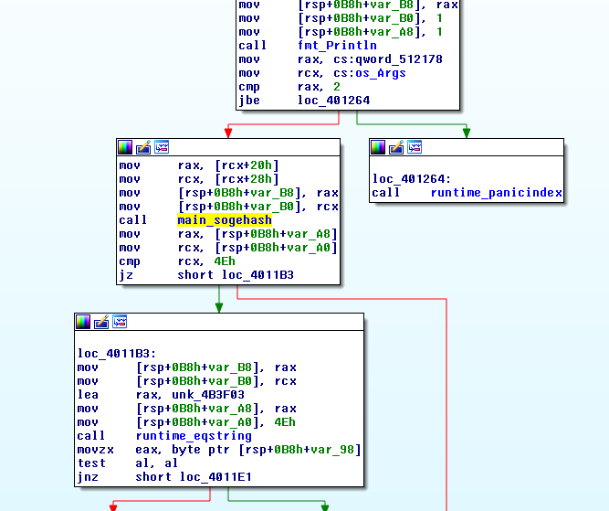

# Be3rP4ck

This is a crackme, and we have to find the flag. I was the first to solve this one, I think I was lucky for it because I spotted a little thing which make me avoid the first part at all.


## Step 1 - Some C and zero reversing skills
As usual, we start with a little reco:

```bash
mitsurugi@dojo:~/chall/ESCAPE$ ./Be3rP4ck 
Flag:
dd
mitsurugi@dojo:~/chall/ESCAPE$ ./Be3rP4ck 
Flag:GAME
mitsurugi@dojo:~/chall/ESCAPE$ echo $?
0
mitsurugi@dojo:~/chall/ESCAPE$
```
Nothing special here. Let's continue.

```bash
mitsurugi@dojo:~/chall/ESCAPE$ strings -12 Be3rP4ck
/lib64/ld-linux-x86-64.so.2
__gmon_start__
__isoc99_scanf
__libc_start_main
SOGETISOGETI
SOGETISOGETI
SOGETISOGETI
SOGETISOGETI
SOGETISOGETI
SOGETISOGETI
SOGETISOGETI
SOGETISOGETI
SOGETISOGETI
SOGETISOGETI
SOGETISOGETI
SOGETISOGETI
SOGETISOGETI
SOGETISOGETI
Well... played?
malloc Failed
inflate failed
aN/mm \)\0I?
l%<r2:ug=1X/sU@d
95751;?>755?
;E?Duz&%).2&
GCC: (Debian 6.3.0-18+deb9u1) 6.3.0 20170516
(...)
```
Before reversing, things got my attention. Did you see the 'inflate failed' message? And did you see the 'Well... played?' message?
Let try something:
```bash
mitsurugi@dojo:~/chall/ESCAPE$ binwalk Be3rP4ck

DECIMAL       HEXADECIMAL     DESCRIPTION
--------------------------------------------------------------------------------
0             0x0             ELF, 64-bit LSB executable, AMD x86-64, version 1 (SYSV)
8384          0x20C0          Zlib compressed data, default compression

mitsurugi@dojo:~/chall/ESCAPE$
```

That's a *huge* hint. We go this way. We can extract the zlib part with binwalk (binwalk -e) and see what we have:
```
mitsurugi@dojo:~/chall/ESCAPE$ cd _Be3rP4ck.extracted/
mitsurugi@dojo:~/chall/ESCAPE/_Be3rP4ck.extracted$ ls
0.elf  20C0  20C0.zlib 
mitsurugi@dojo:~/chall/ESCAPE/_Be3rP4ck.extracted$ file 20C0
20C0: data
mitsurugi@dojo:~/chall/ESCAPE/_Be3rP4ck.extracted$ xxd 20C0 | head
00000000: 3a09 0a03 4e47 444c 4645 4c46 454c 4645  :...NGDLFELFELFE
00000010: 4e46 7b4c 4745 4c46 c56b 0345 4c46 454c  NF{LGELF.k.ELFEL
00000020: 0645 4c46 454c 4645 8447 454c 4645 4c46  .ELFELFE.GELFELF
00000030: 454c 4645 0c46 7d4c 4145 0c46 4a4c 4145  ELFE.F}LAE.FJLAE
00000040: 4a46 454c 4245 4c46 054c 4645 4c46 454c  JFELBELF.LFELFEL
00000050: 0645 0c46 454c 4645 0c46 054c 4645 4c46  .E.FELFE.F.LFELF
00000060: cd4d 4645 4c46 454c ce44 4c46 454c 4645  .MFELFEL.DLFELFE
00000070: 4c56 454c 4645 4c46 414c 4645 4846 454c  LVELFELFALFEHFEL
00000080: 8e4a 4c46 454c 4645 8449 054c 4645 4c46  .JLFELFE.I.LFELF
00000090: 8d43 0645 4c46 454c 7e45 4c46 454c 4645  .C.ELFEL~ELFELFE
mitsurugi@dojo:~/chall/ESCAPE/_Be3rP4ck.extracted$
```

That's a lot of 'ELF' in this file. If you have reversed a lot of ELF file, you should have figured that you have a lot of zeroes in it. And zero is the identity with XOR. So, this file could be an ELF file xored with the key 'ELF'. We can use xortool <https://github.com/hellman/xortool> to check this for us:
```bash
mitsurugi@dojo:~/chall/ESCAPE/_Be3rP4ck.extracted$ ./xortool/xortool/xortool 20C0 -c 00
The most probable key lengths:
   1:   6.5%
   3:   16.9%
   6:   14.9%
   9:   12.9%
  12:   11.1%
  15:   9.6%
  18:   8.4%
  21:   7.4%
  24:   6.5%
  27:   5.8%
Key-length can be 3*n
1 possible key(s) of length 3:
ELF
Found 0 plaintexts with 95.0%+ printable characters
See files filename-key.csv, filename-char_used-perc_printable.csv
mitsurugi@dojo:~/chall/ESCAPE/_Be3rP4ck.extracted$ file xortool_out/0.out 
xortool_out/0.out: ELF 64-bit LSB executable, x86-64, version 1 (SYSV), statically linked, not stripped
mitsurugi@dojo:~/chall/ESCAPE/_Be3rP4ck.extracted$
```

And so the first step of this challenge has been solved with absolutely 0 reversing skills.

## Step 2 - Go for victory
Let go for a reco:
```bash
mitsurugi@dojo:~/chall/ESCAPE/_Be3rP4ck.extracted/xortool_out$ chmod +x 0.out 
mitsurugi@dojo:~/chall/ESCAPE/_Be3rP4ck.extracted/xortool_out$ ./0.out 
-- Real program --
Give me the real flag
panic: runtime error: index out of range

goroutine 1 [running]:
panic(0x498100, 0xc42000a0f0)
	/usr/lib/go-1.7/src/runtime/panic.go:500 +0x1a1
main.main()
	/home/pixis/CTF_Sogeti/re/stage2/stage2.go:20 +0x269
mitsurugi@dojo:~/chall/ESCAPE/_Be3rP4ck.extracted/xortool_out$
```

Some GO program. Yikes! Go programs tend to be statically linked (read: very big). We know that we took the right path because the first line is: "Give me the real flag".

### Reversing some go
Let dive into the joy of dissasembly. In GO, you don't reverse the main() function. The main function in go is just here to setup things, afjust some others etc.. In GO, you search the main.main() function.
The main.main function is not really hard to follow:



You can see on the right the call to panic() if osArgs is different than 2. If we follow the left, we have a call to main\_sogehash function. The output of this function is compared to 0x4E, then runtime\_eqstring is called (runtime\_eqstring is basically strcmp() ).
Everything is in place. We have to call this prog with two args. The output of sogehash function should give a return code of 0x4E and a strcmp() is done just after. We confirm this under gdb:

```
mitsurugi@dojo:~/chall/ESCAPE/_Be3rP4ck.extracted/xortool_out$ gdb -q 0.out
Reading symbols from 0.out...(no debugging symbols found)...done.
gdb$ b main.main
gdb$ r a b 
Starting program: /home/mitsurugi/chall/ESCAPE/_Be3rP4ck.extracted/xortool_out/0.out a b
[New LWP 2953]
[New LWP 2954]
[New LWP 2955]
[New LWP 2956]
Error while running hook_stop:
No symbol table is loaded.  Use the "file" command.

Thread 1 "0.out" hit Breakpoint 1, 0x0000000000401000 in main.main ()
gdb$ x/80i $rip
=> 0x401000 <main.main>:	mov    %fs:0xfffffffffffffff8,%rcx
   0x401009 <main.main+9>:	lea    -0x38(%rsp),%rax
   0x40100e <main.main+14>:	cmp    0x10(%rcx),%rax
   0x401012 <main.main+18>:	jbe    0x401344 <main.main+836>
   0x401018 <main.main+24>:	sub    $0xb8,%rsp
   0x40101f <main.main+31>:	mov    %rbp,0xb0(%rsp)
   0x401027 <main.main+39>:	lea    0xb0(%rsp),%rbp
   0x40102f <main.main+47>:	xorps  %xmm0,%xmm0
   0x401032 <main.main+50>:	movups %xmm0,0x90(%rsp)
   0x40103a <main.main+58>:	lea    0xadffc(%rip),%rax        # 0x4af03d
   0x401041 <main.main+65>:	mov    %rax,0xa0(%rsp)
   0x401049 <main.main+73>:	movq   $0x12,0xa8(%rsp)
   0x401055 <main.main+85>:	movq   $0x0,0x30(%rsp)
   0x40105e <main.main+94>:	movq   $0x0,0x38(%rsp)
   0x401067 <main.main+103>:	lea    0x8f992(%rip),%rax        # 0x490a00
   0x40106e <main.main+110>:	mov    %rax,(%rsp)
   0x401072 <main.main+114>:	lea    0xa0(%rsp),%rcx
   0x40107a <main.main+122>:	mov    %rcx,0x8(%rsp)
   0x40107f <main.main+127>:	movq   $0x0,0x10(%rsp)
   0x401088 <main.main+136>:	callq  0x40b1a0 <runtime.convT2E>
   0x40108d <main.main+141>:	mov    0x18(%rsp),%rax
   0x401092 <main.main+146>:	mov    0x20(%rsp),%rcx
   0x401097 <main.main+151>:	mov    %rax,0x30(%rsp)
   0x40109c <main.main+156>:	mov    %rcx,0x38(%rsp)
   0x4010a1 <main.main+161>:	lea    0x30(%rsp),%rax
   0x4010a6 <main.main+166>:	mov    %rax,(%rsp)
   0x4010aa <main.main+170>:	movq   $0x1,0x8(%rsp)
   0x4010b3 <main.main+179>:	movq   $0x1,0x10(%rsp)
   0x4010bc <main.main+188>:	callq  0x455a80 <fmt.Println>
   0x4010c1 <main.main+193>:	mov    0x1110a8(%rip),%rax        # 0x512170 <os.Args>
   0x4010c8 <main.main+200>:	mov    0x1110a9(%rip),%rcx        # 0x512178 <os.Args+8>
   0x4010cf <main.main+207>:	cmp    $0x3,%rcx
   0x4010d3 <main.main+211>:	jne    0x4010e7 <main.main+231>
   0x4010d5 <main.main+213>:	mov    0x20(%rax),%rcx
   0x4010d9 <main.main+217>:	mov    0x28(%rax),%rax
   0x4010dd <main.main+221>:	cmp    $0x9,%rax
   0x4010e1 <main.main+225>:	je     0x40126b <main.main+619>
   0x4010e7 <main.main+231>:	lea    0xae8dd(%rip),%rax        # 0x4af9cb
   0x4010ee <main.main+238>:	mov    %rax,0x50(%rsp)
   0x4010f3 <main.main+243>:	movq   $0x15,0x58(%rsp)
   0x4010fc <main.main+252>:	movq   $0x0,0x70(%rsp)
   0x401105 <main.main+261>:	movq   $0x0,0x78(%rsp)
   0x40110e <main.main+270>:	lea    0x8f8eb(%rip),%rax        # 0x490a00
   0x401115 <main.main+277>:	mov    %rax,(%rsp)
   0x401119 <main.main+281>:	lea    0x50(%rsp),%rcx
   0x40111e <main.main+286>:	mov    %rcx,0x8(%rsp)
   0x401123 <main.main+291>:	movq   $0x0,0x10(%rsp)
   0x40112c <main.main+300>:	callq  0x40b1a0 <runtime.convT2E>
   0x401131 <main.main+305>:	mov    0x20(%rsp),%rax
   0x401136 <main.main+310>:	mov    0x18(%rsp),%rcx
   0x40113b <main.main+315>:	mov    %rcx,0x70(%rsp)
   0x401140 <main.main+320>:	mov    %rax,0x78(%rsp)
   0x401145 <main.main+325>:	lea    0x70(%rsp),%rax
   0x40114a <main.main+330>:	mov    %rax,(%rsp)
   0x40114e <main.main+334>:	movq   $0x1,0x8(%rsp)
   0x401157 <main.main+343>:	movq   $0x1,0x10(%rsp)
   0x401160 <main.main+352>:	callq  0x455a80 <fmt.Println>
   0x401165 <main.main+357>:	mov    0x11100c(%rip),%rax        # 0x512178 <os.Args+8>
   0x40116c <main.main+364>:	mov    0x110ffd(%rip),%rcx        # 0x512170 <os.Args>
   0x401173 <main.main+371>:	cmp    $0x2,%rax
   0x401177 <main.main+375>:	jbe    0x401264 <main.main+612>
   0x40117d <main.main+381>:	mov    0x20(%rcx),%rax
   0x401181 <main.main+385>:	mov    0x28(%rcx),%rcx
   0x401185 <main.main+389>:	mov    %rax,(%rsp)
   0x401189 <main.main+393>:	mov    %rcx,0x8(%rsp)
   0x40118e <main.main+398>:	callq  0x401350 <main.sogehash>        //Let break here
   0x401193 <main.main+403>:	mov    0x10(%rsp),%rax
   0x401198 <main.main+408>:	mov    0x18(%rsp),%rcx
   0x40119d <main.main+413>:	cmp    $0x4e,%rcx                      //also here
   0x4011a1 <main.main+417>:	je     0x4011b3 <main.main+435>
   0x4011a3 <main.main+419>:	mov    0xb0(%rsp),%rbp
   0x4011ab <main.main+427>:	add    $0xb8,%rsp
   0x4011b2 <main.main+434>:	retq   
   0x4011b3 <main.main+435>:	mov    %rax,(%rsp)
   0x4011b7 <main.main+439>:	mov    %rcx,0x8(%rsp)
   0x4011bc <main.main+444>:	lea    0xb2d40(%rip),%rax        # 0x4b3f03
   0x4011c3 <main.main+451>:	mov    %rax,0x10(%rsp)
   0x4011c8 <main.main+456>:	movq   $0x4e,0x18(%rsp)
   0x4011d1 <main.main+465>:	callq  0x451810 <runtime.eqstring>     // and break here
   0x4011d6 <main.main+470>:	movzbl 0x20(%rsp),%eax
gdb$ 
```

Now, we have to break in the beginning of main.sogehash and eqstring in order to see what's going on:
```bash
(gdb) b main.sogehash
Breakpoint 1 at 0x401350
(gdb) r a b
Starting program: /home/mitsurugi/chall/ESCAPE/_Be3rP4ck.extracted/xortool_out/0.out a b
[New LWP 3048]
[New LWP 3049]
[New LWP 3050]
[New LWP 3051]
[New LWP 3052]
-- Real program --
Give me the real flag

Thread 1 "0.out" hit Breakpoint 1, 0x0000000000401350 in main.sogehash ()
(gdb) x/s $rax
0x7fffffffe3ca:	"b"
(gdb)
 0x0000000000401193 in main.main ()
(gdb) info reg $rax rcx
rax            0xc42007e1ca	842350977482
rcx            0x2	2
(gdb)            // We put 1 char in sogehash, return value is '2'. Other tests shows that return valus is always twice the len(input)
(...)
(gdb)            //and guess what, in GO, the strcmp() send parameters through stack, so:
(gdb) x/gx $rsp+0x10
0xc42003de98:	0x00000000004b3f03
(gdb) x/s 0x00000000004b3f03
0x4b3f03:	"1f4e509605c9f4bf22f4bf22a5c9fe23bbfee5dd22ffdde5fb22aafedcdd22f5f1d6f0a4a5a589reflect.Value.Interface: cannot return value obtained from unexported field or method"
(gdb)
```

In go, strings are not null terminated. So, if we look closely, we can see that the string "1f4e509605c9f4bf22f4bf22a5c9fe23bbfee5dd22ffdde5fb22aafedcdd22f5f1d6f0a4a5a589" is exactly 0x4e character long... 

## Step 3 - Cracking time
Reversing the sogehash function is not really hard. Nothing really fancy, and I reimplemented it under python:

```python
#! /usr/bin/python3

import sys
inp = sys.argv[1]

def rshift(val, n): return val>>n if val >= 0 else (val+0x100000000)>>n

remainder=0
out=''
for i in range(len(inp)):
    num = ord(inp[i])
    temp = ((num<<2) ^ num) ^ remainder
    #print("value", hex(temp))
    out += hex(temp%256)[2:].zfill(2)
    remainder = rshift(temp, 8)

print(out)
```

There is two path for victory here: inverse the hash function, or bruteforce to solution. I took the second option:
```python
#! /usr/bin/python3

import sys
import string

result='1f4e509605c9f4bf22f4bf22a5c9fe23bbfee5dd22ffdde5fb22aafedcdd22f5f1d6f0a4a5a589'

#inp = sys.argv[1]

def rshift(val, n): return val>>n if val >= 0 else (val+0x100000000)>>n

def hashcal(inp):
    remainder=0
    out=''
    for i in range(len(inp)):
        num = ord(inp[i])
        temp = ((num<<2) ^ num) ^ remainder
        #print("value", hex(temp))
        out += hex(temp%256)[2:].zfill(2)
        remainder = rshift(temp, 8)
        #print("remainder", hex(remainder))
    return out

prefix=''
for i in range(int(len(result)/2)):
    for c in string.printable:
        maybe_sol=hashcal(prefix+c)
        if result.startswith(maybe_sol):
            #print(c)
            prefix=prefix+c

print("[+] Here is the flag: %s"% prefix)
```

And in less than in a second:
```bash
mitsurugi@dojo:~/chall/ESCAPE$ ./sogehash2.py 
[+] Here is the flag: SCE{Th1s_1s_th3_r3al_fl4g_w3ll_d0ne!!!}
mitsurugi@dojo:~/chall/ESCAPE$
```
And it was a first blood!

## Outro
I didn't take the time to watch wath was there in the first part. In CTF you run for flag. A friend told me once: "*To solve crackme, you just have to understand enough in order to bruteforce the rest*"

"""Courage doesn't always roar, sometimes it's the quiet voice at the end of the day whispering 'I will try again tomorrow'"""
